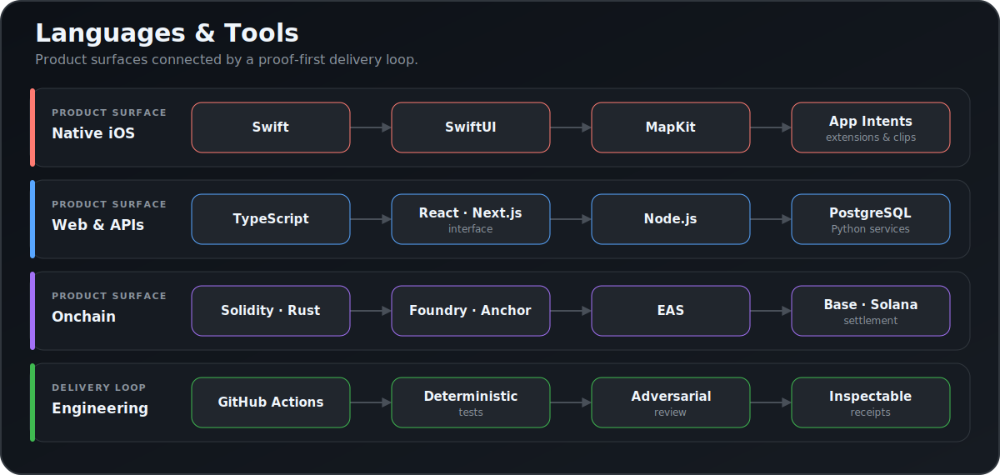

## Hi, I'm Jerry Chen | Founder Engineer 🇹🇼

**Building verifiable agent products across consumer AI, commerce, and onchain settlement.**

[](https://www.jeezlabs.io)
[](https://github.com/jh1nresh)
[](https://x.com/JhiNResH)
[](https://dinq.me/jhinresh)
[](mailto:jhinresh@gmail.com)

I work across native iOS, full-stack TypeScript, Solidity, and Solana. My focus is making agents useful in real workflows through clear permissions, inspectable receipts, deterministic checks, and safe failure when evidence is incomplete.

Based in Irvine, California. Originally from Taiwan. This is the active continuation of the public work previously maintained under `JhiNResH`.

---

### ⚡ About Me

- **Focus:** Consumer AI, agent infrastructure, onchain trust, and proof-gated settlement.
- **Current work:** Shipping SAV-E and building verifiable commerce and reputation systems.
- **Engineering:** SwiftUI, TypeScript, Solidity, Rust, and Python.
- **Operating principle:** Model output remains a proposal until tests, logs, code, or user evidence verifies it.
- **Collaboration:** Open to agent infrastructure, consumer AI, smart-contract, and early-stage product engineering work.
- **Reach me:** [jhinresh@gmail.com](mailto:jhinresh@gmail.com)

---

### 🚀 Selected Work

#### SAV-E: Private Place Memory for iOS

Turns messy travel and food clues from social links, web pages, voice, and Google Takeout into reviewable evidence and confirmed Map Stamps. Uncertain clues stay in Review instead of becoming invented places.

`SwiftUI` · `MapKit` · `App Intents` · `Share Extension` · `App Clip` · `Node.js` · `PostgreSQL`

[Open the web handoff](https://sav-e-app.vercel.app)

#### Maiat Protocol: Trust Infrastructure for Agentic Commerce

Combines agent and token risk signals, community reviews, onchain behavior, and attestations behind a trust API, SDKs, middleware, and deployed Base contracts.

`TypeScript` · `Next.js` · `Solidity` · `Foundry` · `EAS` · `Base`

[Open the live app](https://app.maiat.io) · [Read the API docs](https://app.maiat.io/docs)

#### Match Receipt Engine: Proof-Gated Settlement

Converts sports events into deterministic settlement receipts. Merkle proof verification gates state transitions; tampered evidence blocks settlement and routes funds to a refund path.

`TypeScript` · `Merkle proofs` · `State machines` · `TxLINE` · `Vercel`

[Open the live demo](https://match-receipt-engine.vercel.app) · [Test the tamper path](https://match-receipt-engine.vercel.app/?tamper=1)

---

### 🛠 Languages & Tools

<p align="center">
  
</p>

---

### 🧭 How I Build

```text
customer problem
-> explicit product decision
-> narrow implementation
-> deterministic checks
-> adversarial review
-> inspectable receipt
```

- Repeated workflows need explicit state, feedback, convergence, and stop conditions.
- AI coding agents work inside a reviewable engineering harness; they do not replace product judgment.
- Public claims should point to a live product, reproducible artifact, or verified history.

---

### 🏆 Experience & Recognition

- Founder of **Sponge**, a Solana stablecoin yield project; previously a Growth Developer Intern at **Perena** and a **Wormhole Fellow**.
- **Base Batches 003** Student Track: Top 5 with Maiat.
- **BNB Chain US College Hackathon**: 2nd place with Dojo.
- **Jito Grid Hackathon**: 1st place with Sponge.
- Graduate study in computer science at **Westcliff University**, with prior graduate training in information systems and mechanical engineering.

---

### 🌌 Contribution Archive

This preserved 3D visualization represents public activity from the previous `JhiNResH` profile. It is a historical snapshot, not a live contribution counter.

<p align="center">
  
</p>

---

### ⏱️ Weekly Coding Activity

This privacy-safe section is refreshed manually from WakaTime. It shows the current language mix as supporting evidence, not a productivity score; private project names and repository metrics remain hidden.

<!--START_SECTION:waka-->
_WakaTime activity will appear after the repository secret is configured and the first manual refresh is approved._
<!--END_SECTION:waka-->

---

### 📫 Contact

I am open to conversations about agent infrastructure, verifiable execution, consumer AI, onchain settlement, and early-stage product engineering.

[Portfolio](https://www.jeezlabs.io) · [X](https://x.com/JhiNResH) · [Profile and links](https://dinq.me/jhinresh) · [Email](mailto:jhinresh@gmail.com)

---

Built by [jh1nresh](https://github.com/jh1nresh)
